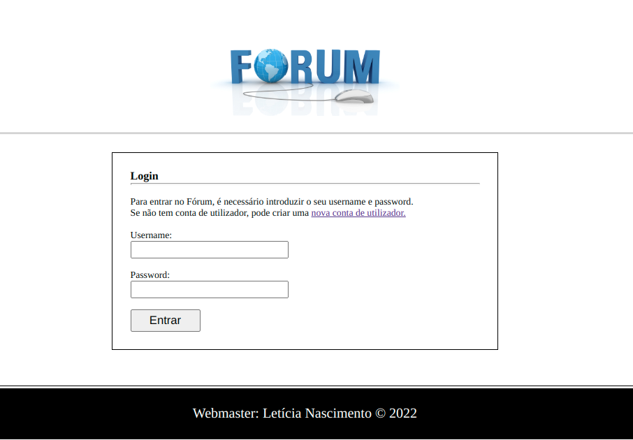

  <a href="#rocket-tecnologias">Tecnologias</a>&nbsp;&nbsp;&nbsp;|&nbsp;&nbsp;&nbsp;
  <a href="#-projeto">Projeto</a>&nbsp;&nbsp;&nbsp;|&nbsp;&nbsp;&nbsp;
  <a href="#-como-rodar">Como rodar</a>&nbsp;&nbsp;&nbsp;|&nbsp;&nbsp;&nbsp;
  <a href="#-como-contribuir">Como contribuir</a>&nbsp;&nbsp;&nbsp;
  

 

  

## Micro Fórum em PHP

## 🚀 Tecnologias

Esse projeto foi desenvolvido com as seguintes tecnologias:

- [PHP](https://www.php.net/) 
- [CSS3](https://developer.mozilla.org/pt-BR/docs/Web/CSS) 

## 💻 Projeto

Exercício simples do site de um fórum realizado em PHP.

Aula do canal [João Ribeiro](https://www.youtube.com/watch?v=eV7GkLq6dCo&list=PLXik_5Br-zO8u5mCnTdAxGuUBbhUM9fa6&index=130)

## 🚀 Como Rodar

- Clone o projeto.
- Entre no repositório e clice duas vezes no arquivo index.html

## 🤔 Como contribuir

- Faça um fork desse repositório;
- Cria uma branch com a sua feature: `git checkout -b minha-feature`;
- Faça commit das suas alterações: `git commit -m 'feat: Minha nova feature'`;
- Faça push para a sua branch: `git push origin minha-feature`.

Depois que o merge da sua pull request for feito, você pode deletar a sua branch.

## 📝 Licença

Esse projeto está sob a licença MIT.
